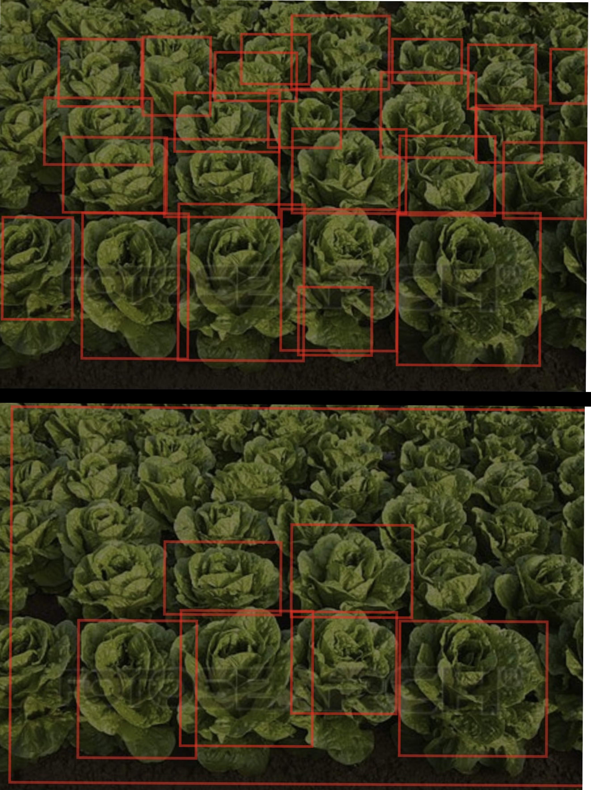
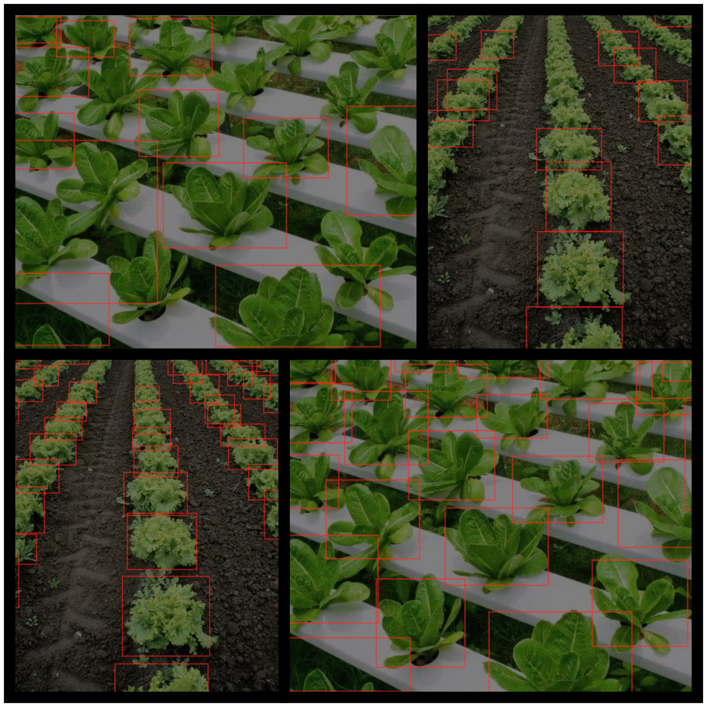

# Lettuce Health Classifier

## Motivation
This project was a part of a one-month internship with MTC(Microsoft Technology Centers) Bengaluru. I was asked to
create this project to be used on the hydroponic setup used in this center. This was only possible thanks to the
guidance, assistance and help offered to me.

## Objective

- To identify lettuces in an image and create bounding boxes around each of them.
- To classify each of those lettuces as either healthy or diseased
- To provide additional details about the lettuce including relative size, location(rows and columns) and green
  intensity.

## Tools Used

- Microsoft Azure Custom Vision Web Portal to train machine learning models
- Tensorflow to use models for prediction
- OpenCv for image processing and visualization

## Approach

### Initial ideas
To accomplish this task, I decided to create two  machine learning models, one for object detection, and the second for
image classification. The object detection model would identify the lettuces in the image, and the area within the box
bounds would be extracted from the original image. This would then be sent to the image classifier which would label it
as diseased or healthy.

### Training the models
I first created the image classifying model, which would differentiate between healthy and diseased lettuces. I 
collected images from two datasets: 
[Lettuce Plant Leaf Datasets](https://github.com/chandru11235/Lettuce-plant-leaf-Datasets) and select images from the
[Plant Disease Classification Dataset](https://github.com/abdullahselek/plant-disease-classification-tf).

For the object detection model, I took these same images, and drew bounding boxes around each lettuce via Azure's web
portal. Both models were trained on a standard domain(accessible via cloud calls) and a compact domain
(available locally). While the image classifier was fairly accurate, the object detector was not, with an especially low
recall value for the model trained on the compact domain.

### Improving accuracy

Using basic data augmentation(cropping, rotating and resizing the image), using Tensorflow's image data generator, I
managed to increase the image count by 300%. New images were added, specifically those involving large clusters of
lettuces in a single image. After all this, the improved model performed significantly better than the first iteration.

An example of a particularly challenging image:

Final Iteration

First Iteration

### Additional Features

#### Location

The third main objective is to identify the row and column of each lettuce. A series of logical conditions handle this,
classifying lettuces in the same row if the height difference is within a particular range. This system has been
generalized to work in most scenarios.

#### Size

The relative size of a lettuce is taken by simply comparing its area to the average area of all identified lettuces.

#### Green Intensity

Represents how green each lettuce is as darker shades contain higher nutrition values. The average of all green pixels
for each lettuce is calculated, and then the green score is accordingly assigned.


## Performance

The image classification model is very accurate, while the local version of the object identification model still leaves
something to be desired. As mentioned before, the cloud version of this model performs far better than its local
counterpart. This becomes obvious while looking at some examples.

Local Model

Cloud model

This result was expected as these images are complex, and the dropped neural network layers lead to lack in recall. This
will probably be improved by increasing the number of training images.

## Output
An image for visualization is displayed and saved, and all important values are stored in output_info.json.

## Usage

### Setting up
```bash
pip install -r requirements.txt
```

### Run

#### Local model
```bash
python main.py image_filename
```

#### Cloud model
Note: An azure subscription and fully trained model will be needed to use this script
```bash
python cloud.py image_filename
```
